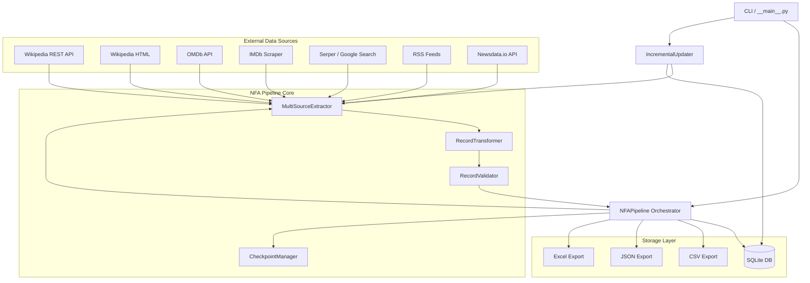
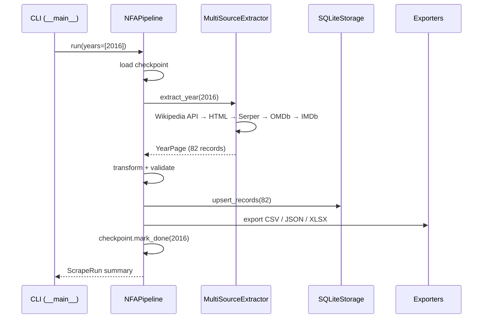

# NFA Data Pipeline — Technical Documentation

> **Version**: 1.0.0 · **Python**: ≥ 3.9 · **License**: MIT

---

## Table of Contents

1. [Architecture Overview](#1-architecture-overview)
2. [Project Structure](#2-project-structure)
3. [Execution Flow](#3-execution-flow)
4. [Module Documentation](#4-module-documentation)
5. [Data Layer](#5-data-layer)
6. [Configuration & Environment Setup](#6-configuration--environment-setup)
7. [Logging & Monitoring](#7-logging--monitoring)
8. [Scalability & Performance](#8-scalability--performance)
9. [Security & Compliance](#9-security--compliance)
10. [Deployment Guide](#10-deployment-guide)
11. [Future Improvements](#11-future-improvements)

---

## 1. Architecture Overview

### 1.1 High-Level System Architecture



### 1.2 Data Flow Diagram

```mermaid
flowchart LR
    A[CLI Args] --> B[Config Load\nsettings.yaml]
    B --> C{Full Run\nor Incremental?}
    C -->|Full| D[NFAPipeline.run]
    C -->|Incremental| E[IncrementalUpdater.run]

    D --> F[For each year]
    F --> G[MultiSourceExtractor\nextract_year]
    G --> H[Wikipedia API\nStep 1a]
    H -->|0 records| I[Wikipedia HTML\nStep 1b]
    H -->|records ✓| J[Serper gap-fill\nStep 2]
    I --> J
    J --> K[OMDb enrichment\nStep 3]
    K --> L[IMDb fallback\nStep 4]
    L --> M[RecordTransformer]
    M --> N[RecordValidator]
    N --> O[SQLite upsert]
    O --> P[CSV / JSON / XLSX export]
    O --> Q[Checkpoint save]

    E --> R[Detect missing years]
    R -->|missing| G
    E --> S[Find null-field records]
    S --> K
```



### 1.3 Component Interaction Diagram



---

## 2. Project Structure

```
nfa_pipeline_project/
└── nfa_pipeline/                    ← Project root
    ├── config/
    │   └── settings.yaml            ← All configuration (scraping, storage, enrichment)
    ├── data/
    │   ├── raw/                     ← Cached raw HTML responses (disk cache)
    │   ├── processed/               ← Output files
    │   │   ├── nfa_awards.db        ← Canonical SQLite database
    │   │   ├── nfa_awards.csv       ← Canonical CSV export
    │   │   ├── nfa_awards.json      ← Canonical JSON export
    │   │   ├── nfa_awards.xlsx      ← Canonical Excel export
    │   │   └── run_YYYYMMDD_HHMMSS_<uuid>/  ← Per-run snapshot folder
    │   ├── cache/
    │   │   └── checkpoint.json      ← Year-level resumption checkpoint
    │   └── logs/
    │       └── pipeline.log         ← Rotating log file (10 MB × 5 backups)
    ├── nfa_pipeline/                ← Python package
    │   ├── __init__.py
    │   ├── __main__.py              ← CLI entry point (argparse)
    │   ├── pipeline.py              ← Full-run orchestrator (NFAPipeline)
    │   ├── incremental.py           ← Incremental update engine
    │   ├── config.py                ← Config loader (Pydantic / YAML)
    │   ├── models.py                ← Data models: AwardRecord, ScrapeRun, YearPage
    │   ├── extractors/
    │   │   ├── multi_source_extractor.py    ← Orchestrates all sources
    │   │   ├── wikipedia_api_extractor.py   ← Wikipedia REST API (primary)
    │   │   ├── wikipedia_extractor.py       ← Wikipedia HTML scraper (fallback)
    │   │   ├── nfa_extractor.py             ← Low-level NFA table parser (BS4)
    │   │   ├── omdb_extractor.py            ← OMDb API + RSS fallback
    │   │   ├── imdb_extractor.py            ← IMDb HTML scraper
    │   │   ├── serper_extractor.py          ← Google Search via Serper API
    │   │   └── rss_extractor.py             ← RSS feed enrichment
    │   ├── transformers/
    │   │   └── record_transformer.py        ← Normalise, clean, derive fields
    │   ├── validators/
    │   │   └── record_validator.py          ← Field-level + batch validation
    │   ├── storage/
    │   │   ├── sqlite_storage.py            ← SQLite persistence + schema migration
    │   │   ├── csv_exporter.py
    │   │   ├── json_exporter.py
    │   │   └── excel_exporter.py
    │   └── utils/
    │       ├── http_client.py               ← Shared HTTP session (retries, delays, cache)
    │       ├── checkpoint.py                ← Year-level resumption state
    │       ├── logging_setup.py             ← Structured logging + progress bar
    │       └── ordinal.py                   ← film_year → ceremony ordinal mapping
    ├── tests/                       ← pytest test suite
    ├── scripts/                     ← Utility scripts
    ├── pyproject.toml               ← Build + tool config (setuptools, pytest, ruff, black, mypy)
    ├── Makefile                     ← Developer convenience targets
    └── TECHNICAL_DOCUMENTATION.md  ← This file
```

---

## 3. Execution Flow

### 3.1 Full Pipeline Execution

```
1. CLI parses args  →  config loaded  →  NFAPipeline.__init__
2. Year list determined (--years | --start-year/--end-year | config defaults)
3. For each year (sequential):
    a. Checkpoint check → skip if already done (unless --force)
    b. MultiSourceExtractor.extract_year(year)
        i.  Wikipedia REST API  (0.2–0.5s)
        ii. Wikipedia HTML      (1–2s, fallback only)
        iii.Serper gap-fill     (0.1s/record, director + language)
        iv. OMDb enrichment     (0.15s/record, rating/genres/runtime/plot)
        v.  IMDb fallback       (1.0s/record, only for records OMDb missed)
    c. RecordTransformer.transform_batch()
    d. RecordValidator.validate_batch()
    e. SQLiteStorage.upsert_records() → INSERT OR REPLACE
    f. Export CSV / JSON / XLSX (canonical + per-run snapshot)
    g. Checkpoint.mark_done(year)
4. Final ScrapeRun summary printed to stdout + log
```

### 3.2 Incremental Update Execution

```
1. IncrementalUpdater.__init__(scan_id=None)
2. Resolve DB path:
    - No scan_id → data/processed/nfa_awards.db (canonical)
    - scan_id   → data/processed/run_<id>/nfa_awards.db
3. Count records before update
4. Detect missing years  (DB years vs config year range)
5. Scrape missing years  (same MultiSourceExtractor pipeline)
6. Query records with any NULL enrichment field
7. Re-enrich with OMDb / RSS / Newsdata  (non-destructive — only fills NULLs)
8. Upsert enriched records
9. Re-export CSV / JSON alongside the updated DB
10. Print IncrementalReport
```

---

## 4. Module Documentation

### 4.1 `__main__.py` — CLI Entry Point

**Purpose**: Parses command-line arguments and routes to the correct pipeline mode.

**Key arguments**:

| Flag | Type | Default | Description |
|---|---|---|---|
| `--years` | `int+` | — | Explicit list of years to scrape |
| `--start-year` / `--end-year` | `int` | config | Year range override |
| `--force` | flag | false | Ignore checkpoint, re-scrape all |
| `--dry-run` | flag | false | Show planned years, exit without scraping |
| `--incremental` | flag | false | Run incremental update instead of full run |
| `--enrich-only` | flag | false | With `--incremental`: skip scraping, fill nulls only |
| `--scan-id` | `str` | — | Target a specific run's DB for incremental update |
| `--list-scans` | flag | false | Print all available scan folders and exit |
| `--status` | flag | false | Print checkpoint status |
| `--reset-checkpoint` | flag | false | Clear checkpoint (next run re-scrapes everything) |
| `--config` | `path` | bundled | Path to custom `settings.yaml` |
| `--log-level` | `str` | `INFO` | Override log level |

**Entry point** (installed script): `nfa-pipeline`

---

### 4.2 `pipeline.py` — NFAPipeline

**Class**: `NFAPipeline(config_path, force_rescrape)`

**`run(years, force_rescrape) → ScrapeRun`**

Orchestrates the full extract→transform→validate→store pipeline for a list of years. One year failure does not abort other years. Writes a timestamped output folder per run (`data/processed/run_<date>_<short-uuid>/`).

**Error handling**: Exceptions during a year's extraction are caught, logged with full traceback, and the year is recorded in `ScrapeRun.years_failed`. Pipeline continues with the next year.

---

### 4.3 `incremental.py` — IncrementalUpdater

**Class**: `IncrementalUpdater(config_path, scan_id)`

**`run(enrich_only=False) → IncrementalReport`**

| Method | Description |
|---|---|
| `run()` | Top-level: missing years → enrichment → export |
| `list_scans(processed_dir)` | Static. Returns all `run_*` folders with DB status |
| `_resolve_db_path()` | Returns canonical or scan-specific DB path |
| `_scrape_years(years)` | Re-uses MultiSourceExtractor for new years |
| `_find_incomplete_records(db)` | Queries NULL enrichment fields (schema-safe) |
| `_enrich_records(records)` | OMDb → RSS → Newsdata (fills NULLs only) |
| `_reexport(rows, run_id, db_path)` | Writes CSV/JSON next to targeted DB |

**Deduplication**: Uses `record_id` primary key (`ceremony_year|category[:40]|film_title[:60]`). `INSERT OR REPLACE` is idempotent.

**Schema safety**: `_find_incomplete_records` performs a `PRAGMA table_info` check before querying — old DBs that predate schema migrations won't crash.

---

### 4.4 `config.py` — Configuration Loader

**`get_config(config_path=None) → Config`**

Loads `settings.yaml` using PyYAML, deserialises into nested Pydantic dataclasses. Environment variable overrides are supported for all API keys (see §6).

**Config sections**: `pipeline`, `scraper`, `paths`, `transformer`, `validator`, `storage`, `logging`, `cache`, `notifications`, `enrichment`.

---

### 4.5 `models.py` — Data Models

#### `AwardRecord` (dataclass)

The canonical unit of the pipeline. Auto-sets `record_id` in `__post_init__`.

#### `ScrapeRun` (dataclass)

Run-level metadata (ID, duration, year counts, validity stats, status).

#### `YearPage` (dataclass)

Raw extraction result for one year: URL, HTML, HTTP status, parse error, list of `AwardRecord`s, source name.

---

### 4.6 Extractors

#### `MultiSourceExtractor`

Orchestrates all sources in priority order. Logs per-step timing.

| Step | Source | Triggered when |
|---|---|---|
| 1a | Wikipedia REST API | Always |
| 1b | Wikipedia HTML | Step 1a returns 0 records |
| 2 | Serper (Google) | `serper_enabled=true` and API key set |
| 3 | OMDb API | `omdb_enabled=true` and API key set |
| 4 | IMDb scraper | Any records still missing `imdb_id` after step 3 |

**Timing log** (after each year):
```
film_year=2016: TIMING — wiki=0.29s | serper=117.84s | omdb=92.15s | imdb=364.21s | total=574.49s
```

#### `WikipediaAPIExtractor`

Uses the Wikipedia REST API (`/api/rest_v1/page/html/{title}`) to fetch structured NFA award pages. Converts the film year to the ceremony ordinal (e.g., 2016 → 64th NFA) using `utils/ordinal.py`.

#### `WikipediaExtractor` + `NFAExtractor`

HTML fallback. Downloads the raw Wikipedia page, parses NFA award tables with BeautifulSoup4 + lxml, yielding structured rows.

#### `OMDbExtractor`

Calls `https://www.omdbapi.com/?t={title}&y={year}&type=movie`. Enriches: `imdb_id`, `imdb_rating`, `imdb_votes`, `runtime_minutes`, `genres`, `plot_summary`, `omdb_released`, `omdb_box_office`, `omdb_poster_url`. Falls back to RSS on 401/failure.

**Rate limit**: Free tier = 1,000 req/day. Built-in `omdb_delay=0.15s` (~6 req/s).

#### `IMDbExtractor`

Scrapes IMDb search results + title pages to fill gaps OMDb misses. Applies `imdb_delay=1.0s` for polite crawling.

#### `SerperExtractor`

Issues Google searches via the Serper API to find missing `director` and `film_language` fields for records where Wikipedia was sparse.

#### `RSSExtractor`

Fetches RSS feeds from film-related sources as a fallback enrichment for `plot_summary` and `release_date` when OMDb fails.

---

### 4.7 `transformers/record_transformer.py`

**`RecordTransformer.transform_batch(records) → List[AwardRecord]`**

Applied transformations:
- Strip leading/trailing whitespace from all string fields
- Unicode normalisation (NFC)
- Title-case: `film_title`, `director`, `category`, `awardee`
- Language alias normalisation: `"hindi"` → `"Hindi"`, `"oriya"` → `"Odia"`, etc.
- Derive `ceremony_number` from `ceremony_year`
- Derive `category_normalized` (lowercased, punctuation-stripped)

---

### 4.8 `validators/record_validator.py`

**`RecordValidator.validate_batch(records) → (valid, invalid)`**

| Rule | Level | Description |
|---|---|---|
| `ceremony_year` present | Error | Required field |
| `category` present | Error | Required field |
| `film_title` present | Error | Required field |
| `ceremony_year` in `[1954, 2030]` | Error | Sane range check |
| `film_title` length ≤ 500 | Warning | Likely parse error if huge |
| Awards count in `[30, 200]` per year | Warning | Batch sanity check |
| Completeness ≥ 70% | Error | Fail if >30% records invalid |

Output: `ValidationReport` with counts of valid / invalid / warning + per-record messages.

---

### 4.9 Storage Layer

#### `SQLiteStorage`

- **File**: `data/processed/nfa_awards.db`
- **Tables**: `award_records`, `scrape_runs`, `raw_pages`
- **Upsert**: `INSERT OR REPLACE` on `record_id` primary key
- **Schema migration**: Automatic `ALTER TABLE ADD COLUMN` on connect for new fields
- **Pragmas**: WAL journal mode, NORMAL synchronous, 64 MB cache

#### Exporters

| Exporter | Output | Notes |
|---|---|---|
| `CSVExporter` | `nfa_awards.csv` | UTF-8 BOM for Excel compatibility |
| `JSONExporter` | `nfa_awards.json` | Indented, includes run metadata |
| `ExcelExporter` | `nfa_awards.xlsx` | Frozen header row, auto-filter, summary sheet |

All exporters write to both the canonical path and the per-run snapshot folder.

---

### 4.10 `utils/`

| Module | Purpose |
|---|---|
| `http_client.py` | Shared `requests.Session` with retry logic, exponential backoff, disk caching (24h TTL), polite delays |
| `checkpoint.py` | JSON-backed year-level state: `done`, `failed`, `in_progress` |
| `logging_setup.py` | Configures `logging` with file handler (rotating) + console handler (colorised) + TQDM progress bar |
| `ordinal.py` | Maps `film_year` → NFA ceremony ordinal (e.g., 2016 → 64) |

---

## 5. Data Layer

### 5.1 SQLite Schema — `award_records`

| Column | Type | Nullable | Description |
|---|---|---|---|
| `record_id` | TEXT | PK | `ceremony_year\|category[:40]\|film_title[:60]` |
| `ceremony_year` | INTEGER | ✗ | Year of NFA ceremony |
| `ceremony_number` | INTEGER | ✓ | Ordinal number (e.g., 64) |
| `category` | TEXT | ✗ | Award category as scraped |
| `category_normalized` | TEXT | ✓ | Lowercased, cleaned |
| `award_type` | TEXT | ✓ | Golden Lotus / Silver Lotus / Certificate of Merit |
| `cash_prize` | TEXT | ✓ | Prize amount as string |
| `film_title` | TEXT | ✗ | Film title (English) |
| `film_title_original` | TEXT | ✓ | Original language title |
| `film_language` | TEXT | ✓ | Primary language of film |
| `film_year` | INTEGER | ✓ | Year film was released |
| `director` | TEXT | ✓ | Director name(s) |
| `awardee` | TEXT | ✓ | Person/entity receiving award |
| `production_company` | TEXT | ✓ | Producer(s) |
| `imdb_id` | TEXT | ✓ | e.g., `tt1234567` |
| `imdb_rating` | TEXT | ✓ | e.g., `8.4` |
| `imdb_votes` | TEXT | ✓ | e.g., `125,432` |
| `runtime_minutes` | INTEGER | ✓ | Film runtime |
| `genres` | TEXT | ✓ | Pipe-separated: `Drama\|Thriller` |
| `plot_summary` | TEXT | ✓ | Short plot description |
| `omdb_box_office` | TEXT | ✓ | US box office from OMDb |
| `omdb_poster_url` | TEXT | ✓ | Poster image URL |
| `omdb_released` | TEXT | ✓ | Release date string from OMDb |
| `box_office_worldwide` | TEXT | ✓ | Worldwide gross |
| `release_date` | TEXT | ✓ | ISO date string |
| `is_sequel` | INTEGER | ✓ | Boolean (0/1) |
| `is_remake` | INTEGER | ✓ | Boolean (0/1) |
| `crew_size` | INTEGER | ✓ | Total credited crew count |
| `data_source` | TEXT | ✓ | `wikipedia_api` / `omdb` / `imdb` |
| `source_url` | TEXT | ✓ | Source URL |
| `scraped_at` | TEXT | ✓ | ISO timestamp |
| `raw_html_hash` | TEXT | ✓ | MD5 of raw HTML (dedup) |
| `is_valid` | INTEGER | ✗ | 1 = passed validation |
| `validation_warnings` | TEXT | ✓ | JSON array of warning strings |
| `validation_errors` | TEXT | ✓ | JSON array of error strings |

### 5.2 Deduplication Key

```
record_id = f"{ceremony_year}|{category[:40]}|{film_title[:60]}"
```

This key is stable, human-readable, and set via `AwardRecord.__post_init__`. `INSERT OR REPLACE` on this key makes upserts idempotent — re-running the pipeline for the same year does not duplicate rows.

### 5.3 Validation Logic

Validation runs twice: per-year (immediately after extraction) and globally (across all records before final export). The `completeness_threshold=0.70` setting will abort the pipeline if fewer than 70% of records pass validation — acting as a gross data quality guard.

### 5.4 Transformation Steps

```
Raw AwardRecord (from scraper)
    │
    ▼ strip_whitespace, normalize_unicode
    │
    ▼ title_case (film_title, director, category, awardee)
    │
    ▼ language_aliases (oriya → Odia, hindi → Hindi, …)
    │
    ▼ derive ceremony_number from ceremony_year
    │
    ▼ derive category_normalized (lowercase, strip punctuation)
    │
    ▼ Validated AwardRecord
```

---

## 6. Configuration & Environment Setup

### 6.1 Installation

```bash
# Clone / unzip the project
cd nfa_pipeline

# Production install
pip install .

# Development install (includes pytest, ruff, black, mypy)
make install-dev
```

**Requires**: Python ≥ 3.9

### 6.2 Runtime Dependencies

| Package | Version | Purpose |
|---|---|---|
| `requests` | ≥ 2.31 | HTTP client |
| `urllib3` | ≥ 2.0 | Connection pooling |
| `beautifulsoup4` | ≥ 4.12 | HTML parsing |
| `lxml` | ≥ 4.9 | Fast HTML/XML parser |
| `pydantic` | ≥ 2.0 | Config validation |
| `pyyaml` | ≥ 6.0 | YAML config loading |
| `openpyxl` | ≥ 3.1 | Excel export |

### 6.3 Environment Variables

API keys can be set in `config/settings.yaml` **or** via environment variables (env vars take precedence):

| Variable | Config key | Description |
|---|---|---|
| `NFA_OMDB_API_KEY` | `enrichment.omdb_api_key` | OMDb API key — 1,000 req/day free tier |
| `NFA_SERPER_API_KEY` | `enrichment.serper_api_key` | Serper API key — 2,500 searches/month free |
| `NFA_NEWSDATA_API_KEY` | `enrichment.newsdata_api_key` | Newsdata.io key (optional) |
| `NFA_CONFIG_PATH` | — | Override path to `settings.yaml` |

> **Tip**: Getting a fresh OMDb key: [omdbapi.com/apikey.aspx](https://www.omdbapi.com/apikey.aspx). Free keys expire if daily quota is exceeded for multiple days — regenerate from the same page.

### 6.4 Key Configuration Options

```yaml
# config/settings.yaml (excerpt)

scraper:
  start_year: 2000      # Earliest year to scrape
  end_year: 2023        # Latest year to scrape
  request_delay_min: 1.0
  request_delay_max: 3.0
  max_retries: 3
  retry_backoff_factor: 2.0

storage:
  sqlite:
    path: "data/processed/nfa_awards.db"
    pragmas:
      journal_mode: "WAL"     # Safe concurrent reads
      cache_size: -64000      # 64 MB SQLite page cache

enrichment:
  omdb_delay: 0.15            # ~6 req/s (free tier safe)
  imdb_delay: 1.0             # Polite scraping

validator:
  completeness_threshold: 0.70   # Abort if <70% valid
```

---

## 7. Logging & Monitoring

### 7.1 Logging Architecture

```
Logger hierarchy (Python logging)
│
├── nfa_pipeline.pipeline                  ← Pipeline orchestrator
├── nfa_pipeline.extractors.multi_source_extractor   ← Step-level + TIMING
├── nfa_pipeline.extractors.wikipedia_api_extractor
├── nfa_pipeline.extractors.omdb_extractor
├── nfa_pipeline.extractors.imdb_extractor
├── nfa_pipeline.extractors.serper_extractor
├── nfa_pipeline.transformers.record_transformer
├── nfa_pipeline.validators.record_validator
├── nfa_pipeline.storage.sqlite_storage
└── nfa_pipeline.incremental
```

**Log format**: `YYYY-MM-DD HH:MM:SS | LEVEL    | module_name | message`

**Outputs**:
- Console (colorised, configurable level)
- File: `data/logs/pipeline.log` — rotating, max 10 MB, 5 backups kept

### 7.2 Per-Step Timing Logs

Every year logs individual phase durations:

```
film_year=2016: TIMING — wiki=0.29s | serper=117.84s | omdb=92.15s | imdb=364.21s | total=574.49s
```

Sub-step detail:
```
[Step 1a] Wikipedia REST API — 0.29s → 82 records
[Step 1b] Wikipedia HTML — 1.21s → 0 records    ← only logged if API fails
```

### 7.3 Error Tracking

| Scenario | Behaviour |
|---|---|
| HTTP 4xx (e.g., OMDb 401) | `WARNING` per record, continue |
| HTTP 5xx / timeout | Retry with exponential backoff (max 3 attempts), then `WARNING` |
| Year extraction failure | `ERROR` + traceback, continue to next year |
| Validation threshold breach | `ERROR`, pipeline raises exception |
| Missing DB column | Schema migration runs automatically on next connect |

### 7.4 Retry / Failure Handling

```
Attempt 1 → failure → wait 2s
Attempt 2 → failure → wait 4s
Attempt 3 → failure → wait 8s → record warning, move on
```

Backoff factor is configured via `scraper.retry_backoff_factor`.

**Checkpoint**: Completed years are persisted in `data/cache/checkpoint.json`. On re-run, only failed/missing years are re-scraped.

---

## 8. Scalability & Performance

### 8.1 Current Throughput

| Phase | Bottleneck | Typical Time/Year |
|---|---|---|
| Wikipedia scraping | Network I/O | 0.3–2.0 s |
| Serper gap-fill | API rate limit (0.1s/req) | 6–120 s |
| OMDb enrichment | Free tier rate (0.15s/req) | 12–22 s |
| IMDb fallback (worst case) | Polite delay (1.0s/req) | 60–360 s |

A full 24-year run (2000–2023) typically takes **2–6 hours** depending on OMDb/IMDb availability.

### 8.2 Optimization Strategies

1. **Disk cache** (`data/raw/`, TTL 24h): Wikipedia pages are cached so re-runs within 24 hours skip the HTTP fetch entirely.

2. **Checkpoint resumption**: Pipeline can be safely interrupted and restarted — already-completed years are skipped.

3. **Selective re-enrichment** (`--enrich-only`): Re-enriches only records with null fields, avoiding re-scraping years already in the DB.

4. **OMDb delay tuning**: Reduce `omdb_delay` to `0.10s` for paid OMDb accounts (no rate limit). The free tier allows ~1,000 req/day.

5. **Serper budget**: Filter Serper calls to only records truly missing `director` — reduces API budget usage.

### 8.3 Parallelization

The pipeline is currently **sequential** (one year at a time). This is intentional for two reasons:
- Wikipedia and IMDb require polite crawling delays
- Simpler error handling and checkpoint state

**If parallelism is needed**, each year is independent and can be split across multiple processes using `--years` to pass disjoint year ranges to separate invocations. SQLite WAL mode supports concurrent writes safely.

### 8.4 Bottleneck Analysis

```
IMDb fallback       ████████████████████████  ~64% of runtime (1.0s/record)
Serper gap-fill     ████████                  ~21% of runtime (0.1s/record × 60+ records)
OMDb enrichment     ████                      ~13% of runtime
Wikipedia scraping  ▌                         ~2%  of runtime
```

**Key recommendation**: Populate OMDb key before running to maximize hit rate — every OMDb miss falls through to the slower IMDb scraper.

---

## 9. Security & Compliance

### 9.1 Credential Handling

- **Never commit API keys** to version control. `.gitignore` excludes `config/settings.yaml` if it contains a key — prefer environment variables for production.
- Keys are read from env vars at runtime: `NFA_OMDB_API_KEY`, `NFA_SERPER_API_KEY`.
- No keys are logged (log lines use `"key=set"` rather than printing the key value).

### 9.2 Data Protection

- All scraped data is sourced from **publicly available** Wikipedia pages and open film databases (IMDb, OMDb).
- No personal data beyond public award recipient names is collected.
- Raw HTML caches are stored on disk and not transmitted externally.

### 9.3 Web Scraping Compliance

| Setting | Value | Purpose |
|---|---|---|
| `respect_robots_txt` | `true` | Observes Wikipedia robots.txt |
| `user_agent` | Modern Chrome UA | Identifies as browser |
| `request_delay_min` | 1.0s | Polite minimum delay |
| `request_delay_max` | 3.0s | Randomised upper bound |

IMDb and Wikipedia are scraped within their public fair-use terms. OMDb and Serper are used via official APIs with API keys.

---

## 10. Deployment Guide

### 10.1 Local Setup

```bash
# 1. Install dependencies
make install-dev

# 2. Set API keys
export NFA_OMDB_API_KEY="your_omdb_key"
export NFA_SERPER_API_KEY="your_serper_key"

# 3. Dry run to verify
make run-dry

# 4. Single year test
make run-year YEAR=2016

# 5. Full run
make run
```

### 10.2 Makefile Quick Reference

| Target | Description |
|---|---|
| `make run` | Full pipeline (2000–2023) |
| `make run-year YEAR=2020` | Single year |
| `make run-dry` | Plan only, no scraping |
| `make update-incremental` | Scrape missing years + fill nulls |
| `make update-enrich-only` | Fill nulls only, no rescraping |
| `make list-scans` | List available scan snapshots |
| `make status` | Show checkpoint state |
| `make reset` | Clear checkpoint |
| `make test` | Run test suite with coverage |
| `make lint` | Ruff linter |
| `make format` | Black auto-format |
| `make typecheck` | mypy type check |
| `make clean` | Remove build artifacts |

### 10.3 Running Incrementally

```bash
# List available scan snapshots
python -m nfa_pipeline --list-scans

# Update a specific scan
python -m nfa_pipeline --incremental --scan-id run_20260218_194250_518b1acc

# Update canonical DB
python -m nfa_pipeline --incremental
```

### 10.4 Production Deployment (Scheduled)

For a nightly enrichment job (e.g., cron or GitHub Actions):

```yaml
# .github/workflows/nightly_update.yml (example)
name: Nightly Incremental Update
on:
  schedule:
    - cron: "0 2 * * *"    # 2 AM UTC daily
jobs:
  update:
    runs-on: ubuntu-latest
    steps:
      - uses: actions/checkout@v4
      - uses: actions/setup-python@v4
        with: { python-version: "3.11" }
      - run: pip install .
      - run: python -m nfa_pipeline --incremental --enrich-only
        env:
          NFA_OMDB_API_KEY: ${{ secrets.NFA_OMDB_API_KEY }}
          NFA_SERPER_API_KEY: ${{ secrets.NFA_SERPER_API_KEY }}
      - uses: actions/upload-artifact@v4
        with:
          name: nfa-dataset
          path: data/processed/nfa_awards.*
```

### 10.5 CI/CD Considerations

- **Test gate**: `make test` must pass before merge (pytest + coverage)
- **Lint gate**: `make lint && make format-check`
- **Type gate**: `make typecheck`
- **Secrets**: Store all API keys in CI secrets — never in code or config files committed to the repo
- **Data as artifact**: Export `data/processed/nfa_awards.*` as pipeline artifacts for downstream consumers

---

## 11. Future Improvements

### 11.1 Suggested Enhancements

| Priority | Enhancement | Notes |
|---|---|---|
| High | Parallel year scraping | Use `concurrent.futures.ProcessPoolExecutor` with per-process SQLite connections |
| High | OMDb paid-tier support | Remove rate-limit delays, bump to ~10 req/s |
| Medium | PostgreSQL storage backend | Replace SQLite for multi-user / cloud deployments |
| Medium | API server mode | FastAPI wrapper to serve `award_records` as REST endpoints |
| Medium | Data quality dashboard | Streamlit or Plotly Dash dashboard over the SQLite DB |
| Medium | Newsdata.io full integration | Currently RSS fallback only; full Newsdata API for plot/reviews |
| Low | Celebrity / director disambiguation | Serper calls to reconcile ambiguous name matches |
| Low | Multi-language Wikipedia | Scrape Hindi/regional NFA pages for richer metadata |
| Low | Configurable export schedules | Write exports only when data changes (hash comparison) |

### 11.2 Technical Debt

| Item | Location | Description |
|---|---|---|
| Hard-coded ordinal mapping | `utils/ordinal.py` | Films from 1954–1999 require manual ordinal entries |
| Blocking HTTP | `http_client.py` | Switching to `httpx` + `asyncio` would enable true async I/O |
| No DB migrations framework | `sqlite_storage.py` | Schema migrations use raw `ALTER TABLE`; Alembic would be more robust |
| Serper cost not metered | `serper_extractor.py` | No budget tracking — could exhaust free-tier silently |
| IMDb ToS risk | `imdb_extractor.py` | IMDb HTML scraping may violate ToS; prefer the official IMDb API when available |
| `settings.yaml` has live key | `config/settings.yaml` | OMDb key is committed in plaintext; migrate to env-var-only |

---

*Last updated: 2026-02-19 · Maintained by the NFA Pipeline team.*
